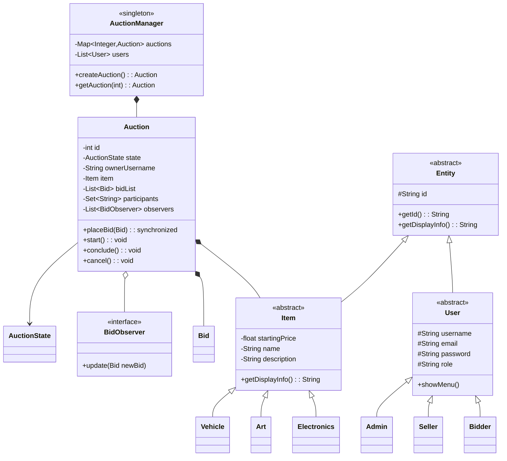

```mermaid
classDiagram
    direction TB

    %% ─────────────────────────────────────────
    %%  CORE DOMAIN CLASSES
    %% ─────────────────────────────────────────

    class AuctionManager {
        <<singleton>>
        -Map~Integer,Auction~ auctions
        -List~User~ users
        +createAuction() : Auction
        +getAuction(int) : Auction
    }

    class Auction {
        -int id
        -AuctionState state
        -String ownerUsername
        -Item item
        -List~Bid~ bidList
        -Set~String~ participants
        -List~BidObserver~ observers
        +placeBid(Bid) : synchronized
        +start() : void
        +conclude() : void
        +cancel() : void
    }

    class Entity {
        <<abstract>>
        #String id
        +getId() : String
        +getDisplayInfo() : String
    }

    class User {
        <<abstract>>
        #String username
        #String email
        #String password
        #String role
        +showMenu()
    }

    class Bidder
    class Seller
    class Admin

    class Item {
        <<abstract>>
        -float startingPrice
        -String name
        -String description
        +getDisplayInfo() : String
    }

    class Electronics
    class Art
    class Vehicle

    class Bid
    
    class BidObserver {
        <<interface>>
        +update(Bid newBid)
    }

    class AuctionState

    %% ─────────────────────────────────────────
    %%  RELATIONSHIPS (Mapped to match your image)
    %% ─────────────────────────────────────────

    AuctionManager *-- Auction
    
    Entity <|-- User
    Entity <|-- Item

    User <|-- Bidder
    User <|-- Seller
    User <|-- Admin

    Item <|-- Electronics
    Item <|-- Art
    Item <|-- Vehicle

    Auction *-- Item
    Auction *-- Bid
    Auction o-- BidObserver
    Auction --> AuctionState
```